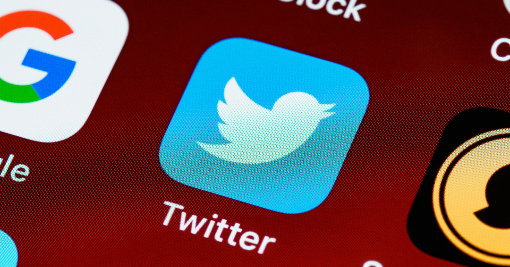
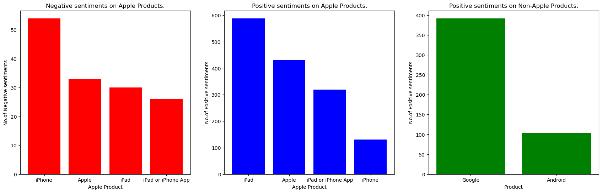

## <span style="font-family:Georgia, serif;">**Twitter Sentiment Analysis** :Understanding Emotions in Tweets about Apple and Google products.</span>



## Overview

In this project, we will begin by constructing a straightforward baseline model for sentiment prediction, categorizing sentiments as either positive or negative. Subsequently, we will advance our approach by building a more sophisticated model capable of recognizing sentiments as positive, negative, or neutral. Our methodology will heavily rely on Natural Language Processing (NLP) techniques to preprocess the text data into a format suitable for model interpretation.

In the modeling phase, we will employ both supervised and unsupervised learning techniques. On the supervised front, we will create a pipeline that integrates multiple classifiers, enabling us to evaluate their performance through cross-validation scores. In the unsupervised domain, we will develop a neural network that functions similarly to the classifiers, utilizing it for sentiment prediction on textual data.

Leveraging our neural network, we will carry out sentiment predictions for a document and conduct evaluations specifically focused on product-related sentiments.

## Business Understanding

**Business Problem**: Using Sentiment Analysis to Improve Apple and Google Product Marketing Strategies 

The introduction of social media has completely changed how businesses interact with their consumers and the general public in today's connected society. While the digital age offers limitless possibilities for marketing and brand development, it also brings its own set of difficulties. One of these difficulties is the inability of enterprises to precisely gauge public opinion and feelings towards their goods or services.

## Data understanding

**Dataset Overview:**
This dataset comprises 8,721 entries organized into three distinct columns: tweet_text, emotion_in_tweet_is_directed_at, and is_there_an_emotion_directed_at_a_brand_or_product. Each entry in the dataset represents a tweet along with associated metadata regarding the product or brand it's directed at and the emotional sentiment conveyed within the tweet.

**Data Exploration and Analysis:**

To gain a deeper understanding of the dataset and its implications, exploratory data analysis (EDA) techniques, natural language processing (NLP) methods, and sentiment analysis tools can be applied.
EDA involves a series of techniques and methods to gain insights into the structure, content, and patterns within the textual information.

## Data Preparation

Text Preprocessing:Before conducting EDA, it's crucial to preprocess the text data. Common preprocessing steps include:
* Lowercasing: Convert all text to lowercase to ensure consistency.
* Tokenization: Split text into individual words or tokens.
* Stop Word Removal: Eliminate common and uninformative words like "the," "and," "in.
* Punctuation Removal: Remove special characters, punctuation marks, and symbols.
* Lemmatization or Stemming: Reduce words to their root form for better analysis.

Natural Language Processing (NLP) relies on regression techniques, necessitating the transformation of text data into numerical vectors that machine learning algorithms can comprehend and process effectively. This conversion can be achieved through various methods, such as GloVe (Global Vectors for Word Representation), Word2Vec, TF-IDF (Term Frequency-Inverse Document Frequency), and BERT (Bidirectional Encoder Representations from Transformers). In our particular scenario, we will opt for TF-IDF, which we ill be incorporating into a function designed to convert our text data. This function will also incorporate Compressed Sparse Row (CSR) matrices to transform the TF-IDF training matrix into a space-efficient CSR matrix format.

## Text Analysis

We can calculate word frequencies, and print the top 10 most frequent words along with their normalized frequencies

```python
tweets_freqdist_top_10 = tweets_freqdist.most_common(10)
print(f'{"Word":<10} {"Normalized Frequency":<20}')
for word in tweets_freqdist_top_10:
    normalized_frequency = word[1] / total_word_count
    print(f'{word[0]:<10} {normalized_frequency:^20.4}')
```
| Word        | Normalized Frequency |
| ----------- | -----------          |
| sxsw        | 0.0858               |
| mention     | 0.06442              |
| link        | 0.03821              |
| rt          | 0.02743              |

## Modeling & Evaluation

Baseline Model:

```python
rf =  Pipeline([('Random Forest', RandomForestClassifier(n_estimators=100, verbose=True))])
svc = Pipeline([('Support Vector Machine', SVC())])
lr = Pipeline([('Logistic Regression', LogisticRegression())])

models = [('Random Forest', rf),('Support Vector Machine', svc),('Logistic Regression', lr)]

scores = [(name, cross_val_score(model,X_tf_idf_train_bi, y_train_bi, cv=2).mean()) for name, model, in models]

(Output):
[('Random Forest', 0.8626880440204012),
 ('Support Vector Machine', 0.8582943167130577),
 ('Logistic Regression', 0.8447452254919312)]
```
Based on these scores, the Random Forest model achieved the highest mean accuracy, followed by the Support Vector Machine and Logistic Regression models. We can use the Random Forest model as our final baseline model.

Iterated Model:

```python
model_2 = Sequential()

model_2.add(Dense(64, activation='relu', input_shape=(6486,)))
model_2.add(Dropout(0.5))

model_2.add(Dense(3, activation='softmax'))

model_2.compile(optimizer="adam",loss='categorical_crossentropy',metrics=["accuracy"]) 
```
### Apple/Google Evaluation



### Recommendations and Conclusion

As evident from the preceding visualizations, iPhones play a significant role in generating a substantial number of negative reviews concerning Apple. Conversely, iPads tend to contribute significantly to the positive feedback received by Apple. Meanwhile, Google receives a higher proportion of positive remarks compared to Android. However, it's worth noting that Apple still outperforms Google in terms of positive reviews. Based on these observations, we can formulate the following recommendations:

* Investigate the common issues or concerns raised by users of iPhones in negative reviews and take proactive steps to address them.

* Consider expanding the iPad product line or introducing new versions to maintain positive customer sentiment.

* Leverage the favorable feedback received by Google products and services to bolster brand reputation and customer loyalty.

* Understand the factors contributing to Apple's overall higher positive reviews compared to Google and utilize these insights to maintain a positive image.

In conclusion,the recommendations emphasize the importance of a customer-centric approach. Addressing customer concerns, improving product quality, and engaging with customers effectively are vital for maintaining a positive brand image.

